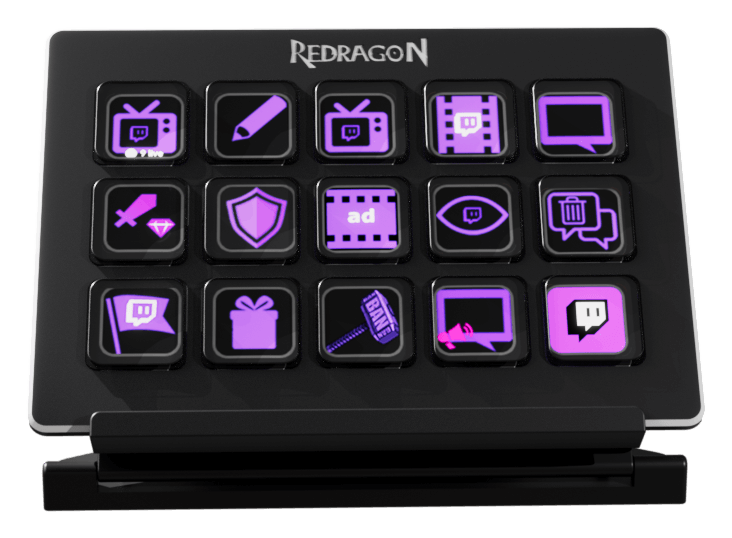

# Redragon Stream Deck para Linux

[English](README.md) · **Español**

Driver y panel de control open source para el **Redragon SS-550 Stream Deck** en Linux.



**Funciona en cualquier distribución.** No está atado a ninguna: se compila desde
el código y habla con el dispositivo por USB, así que corre igual en Fedora,
Debian, Arch, openSUSE, Gentoo, Void o NixOS. Lo único que cambia es cuánto
trabajo te ahorra el instalador.


> **Este archivo es un resumen.** La documentación completa —todas las opciones
> del instalador, la referencia de comandos, las integraciones y la solución de
> problemas— está en el [README en inglés](README.md), que es el que se mantiene
> al día. Se hizo así a propósito: dos documentos largos en paralelo divergen, y
> más vale un resumen correcto que una traducción desactualizada.

## Qué hace

- Interfaz gráfica nativa (Tauri/GTK) con páginas, grilla de 15 teclas y
  biblioteca de acciones
- Iconos personalizados, control de brillo y navegación desde las teclas físicas
- Comandos, URLs, escritura de texto, atajos de teclado y secuencias con delays
- Atajos globales y perfiles que cambian de página según la aplicación activa
- Widgets que se actualizan solos: reloj, fecha, CPU, RAM, temperatura,
  temporizador, clima y música
- Integración con OBS Studio (WebSocket 5.x) y con la API de Twitch
- Funciona en Wayland (Hyprland, Sway, GNOME) y en X11
- Cerrar la ventana no cierra la aplicación: se oculta en la bandeja

## Instalación

```bash
git clone https://github.com/Rene-Kuhm/redragon-streamdeck-linux.git
cd redragon-streamdeck-linux
./install.sh
```

Eso es todo en una distribución soportada. La compilación tarda unos minutos.

El instalador detecta la distribución leyendo `/etc/os-release`, instala las
dependencias, configura la regla udev y ydotool, compila, instala los binarios en
`/usr/local/bin` y deja el arranque automático listo con systemd.

**Al terminar, desconectá y volvé a conectar el Stream Deck** para que la regla
udev se le aplique.

| Distribución | Qué hace falta |
|---|---|
| Fedora/RHEL, Debian/Ubuntu, Arch, openSUSE | Nada: `./install.sh` |
| Derivados (Mint, Pop!_OS, CachyOS, EndeavourOS, Nobara…) | Nada: se reconocen por `ID_LIKE` |
| Cualquier otra (Gentoo, Void, NixOS…) | Instalar dependencias a mano y usar `./install.sh --skip-deps` |

### Opciones

| Opción | Efecto |
|---|---|
| `--build-only` | Solo compila; no toca el sistema |
| `--skip-deps` | No instala dependencias |
| `--no-autostart` | No configura el arranque automático |
| `--daemon-only` | Solo el daemon, sin interfaz gráfica |
| `-h`, `--help` | Ayuda |

Cualquier otra opción se rechaza con un error.

### Sin entorno gráfico o sin systemd

El daemon maneja el dispositivo y no enlaza Tauri, GTK ni WebKit, así que corre
en un equipo sin escritorio con `./install.sh --daemon-only`.

Si tu sistema usa otro init (runit, OpenRC, s6), la aplicación funciona igual
—no depende de systemd— pero el arranque lo configurás vos con
`./install.sh --no-autostart`. Ver el
[README en inglés](README.md#systems-without-systemd) para el detalle de
`ydotoold` en ese caso.

## Uso

```bash
redragon-streamdeck
```

O buscá "Redragon Stream Deck" en el menú de aplicaciones. El arranque automático
se gestiona con systemd:

```bash
systemctl --user status  redragon-streamdeck
systemctl --user enable  --now redragon-streamdeck
systemctl --user disable --now redragon-streamdeck
```

## Problemas frecuentes

**No se detecta el dispositivo:**

```bash
lsusb | grep "0200:1000"
cat /etc/udev/rules.d/60-redragon-streamdeck.rules
```

Después desconectá y volvé a conectar el aparato.

**Los atajos de teclado no andan:** revisá que estés en el grupo `input` y que el
socket sea accesible.

```bash
groups | grep input
stat -c '%a %U:%G %n' /run/ydotoold/socket   # debe dar: 660 root:input
```

Si no estás en el grupo: `sudo usermod -aG input $USER` y volvé a iniciar sesión.

**"Interface Busy":** hay otro proceso con el dispositivo tomado, normalmente la
interfaz y el daemon a la vez. `systemctl --user restart redragon-streamdeck`.

El detalle completo está en el
[README en inglés](README.md#troubleshooting).

## Dispositivos compatibles

- Redragon SS-550 (USB ID `0200:1000`)
- Posiblemente otros basados en StreamDock/Mirabox

## Licencia

MIT. Ver [LICENSE](LICENSE).

---

⭐ Si te sirvió, una estrella ayuda a que otros lo encuentren.
