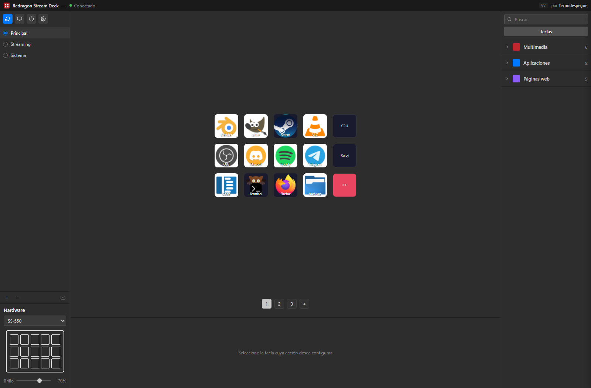
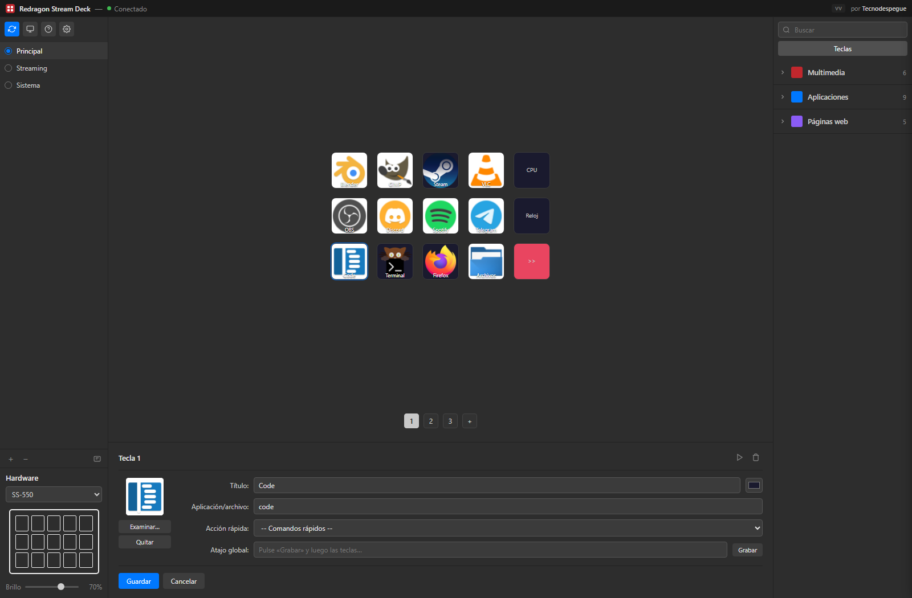

# Redragon Stream Deck for Linux

**English** · [Español](README.es.md)

Open source driver and control panel for the **Redragon SS-550 Stream Deck** on Linux.

**It runs on any Linux distribution.** Nothing here is tied to one: the project
is built from source and talks to the device over USB, so it behaves the same on
Fedora, Debian, Arch, openSUSE, Gentoo, Void, NixOS or whatever you use. The only
thing that changes between them is how much work the installer saves you — see
[Installation](#installation).




Each key is configured from the bottom panel: title, application or command,
predefined quick actions, and a recorded global shortcut.



---

## Table of contents

- [Features](#features)
- [Installation](#installation)
  - [Quick install](#quick-install)
  - [What the installer actually does](#what-the-installer-actually-does)
  - [Distribution support](#distribution-support)
  - [Installer options](#installer-options)
  - [Distributions the installer does not know](#distributions-the-installer-does-not-know)
  - [Systems without systemd](#systems-without-systemd)
  - [Headless machines](#headless-machines)
- [Usage](#usage)
- [Button commands](#button-commands)
- [Integrations](#integrations)
- [Button layout](#button-layout)
- [Project structure](#project-structure)
- [Updates](#updates)
- [Troubleshooting](#troubleshooting)
- [Uninstall](#uninstall)
- [Supported devices](#supported-devices)
- [Contributing](#contributing)

---

## Features

### Core
- Native GUI (Tauri/GTK) in three columns: pages on the left, the key grid in
  the centre, and a searchable action library on the right
- Multiple pages of buttons
- Custom icons (100×100)
- Runs system commands
- Brightness control
- Page navigation from the physical keys
- **Closing the window does not quit the app**: it hides in the tray and the
  device keeps working
- Works on Wayland (Hyprland, Sway, GNOME) and X11

### Advanced
- **URLs**: open a web page from a key
- **Text**: type text automatically (via ydotool)
- **Hotkeys**: send key combinations (Ctrl+C, Alt+Tab, …)
- **Global shortcuts**: trigger a key from the keyboard without touching the device
- **Multi-action**: command sequences with delays
- **Per-application profiles**: switch page automatically based on the focused window

### Live widgets
- **Clock**: current time, with or without seconds
- **Date**: day, month, year, weekday
- **System**: CPU %, RAM %, temperature
- **Timer**: configurable countdown
- **Weather**: current temperature and conditions (Open-Meteo)
- **Music**: what is playing, via playerctl

### Streaming integrations
- **OBS Studio** (WebSocket 5.x): start/stop streaming and recording, switch
  scenes, mute the microphone, live status widget
- **Twitch API**: viewer and follower counts on keys, create clips, run
  commercials, send chat messages

---

## Installation

### Quick install

```bash
git clone https://github.com/Rene-Kuhm/redragon-streamdeck-linux.git
cd redragon-streamdeck-linux
./install.sh
```

That is the whole thing on a supported distribution. The build takes a few
minutes — it compiles a Rust workspace. Everything the script does is described
below, because piping an installer at your system without knowing what it
touches is a bad habit.

### What the installer actually does

In order:

**1. Detects your distribution.** It reads `/etc/os-release` and matches `ID`
and `ID_LIKE` against four families: `fedora`, `debian`, `arch` and `suse`.
Matching on `ID_LIKE` is why derivatives work without being listed one by one —
Linux Mint, Pop!_OS, EndeavourOS, CachyOS, Nobara and the rest resolve to their
parent family. If nothing matches, it stops and tells you to use `--skip-deps`
rather than failing halfway through.

**2. Installs system dependencies** with your package manager (`dnf`,
`apt-get`, `pacman` or `zypper`). The set is the same everywhere, only the
package names differ:

| Purpose | What is installed |
|---|---|
| Toolchain | C/C++ compiler, `make`, `pkg-config`, `git`, `curl` |
| Device access | `libusb` 1.0 |
| GUI | GTK 3, WebKit2GTK 4.1 |
| Tray icon | `librsvg`, Ayatana AppIndicator |
| TLS | OpenSSL |
| Key labels | DejaVu Sans font |
| Keyboard actions | `ydotool` |
| Music widget | `playerctl` |

With `--daemon-only` the graphical packages (`webkit`, `gtk`, `appindicator`,
`librsvg`) are filtered out, so a headless box does not pull in half a desktop.

**3. Installs the udev rule** at `/etc/udev/rules.d/60-redragon-streamdeck.rules`:

```
SUBSYSTEM=="usb", ATTR{idVendor}=="0200", ATTR{idProduct}=="1000", TAG+="uaccess"
```

Two deliberate choices here:

- It uses `TAG+="uaccess"`, which grants access to the user of the active local
  session — exactly what is needed. It does **not** use `MODE="0666"`, which
  would make the device writable by every user on the machine and gains nothing.
- The filename starts with `60-` so it is evaluated **before**
  `73-seat-late.rules`, which is what applies `uaccess`. A rule named `99-`
  would run after it and the tag would silently do nothing.

If a rule from an older version is present (`99-redragon-streamdeck.rules` or
`99-redragon.rules`, both world-writable) the installer removes it.

**4. Configures ydotool**, which is what makes the keyboard actions work. It
writes a `ydotoold.service` unit that puts the socket at
`/run/ydotoold/socket` with permissions `0660` and group `input` — not in
`/tmp`, which is world-writable and cleaned out by several distributions. It
then adds you to the `input` group if you are not in it, and writes
`~/.config/environment.d/60-redragon-ydotool.conf` so the app finds the socket:

```
YDOTOOL_SOCKET=/run/ydotoold/socket
```

Being added to a group only takes effect on a new login session.

**5. Installs Rust** via rustup if `cargo` is not already on your `PATH`
(stable toolchain, minimal profile). If you already have Rust, it is left alone.

**6. Builds** with `cargo build --release --workspace`, or only the daemon crate
under `--daemon-only`.

**7. Installs the binaries** to `/usr/local/bin`. The daemon is always installed
— it is what drives the device and it runs fine without a desktop. The GUI is
installed unless you passed `--daemon-only`, along with a `.desktop` entry in
`~/.local/share/applications`.

**8. Enables autostart** through systemd user units, unless you passed
`--no-autostart`.

After installing, **unplug and replug the Stream Deck** so the new udev rule
applies to it.

### Distribution support

| Distribution | What you need to do |
|---|---|
| Fedora/RHEL, Debian/Ubuntu, Arch, openSUSE | Nothing: `./install.sh` |
| Derivatives (Mint, Pop!_OS, CachyOS, EndeavourOS, Nobara…) | Nothing: recognised through `ID_LIKE` |
| Anything else (Gentoo, Void, NixOS, Slackware…) | Install the dependencies yourself, then `./install.sh --skip-deps` |

openSUSE is not covered by CI: package names drift between Leap and Tumbleweed.
If one of them fails to resolve, install by hand and use `--skip-deps`.

### Installer options

| Option | Effect |
|---|---|
| `--build-only` | Build only; installs nothing and touches nothing on the system |
| `--skip-deps` | Do not install system dependencies |
| `--no-autostart` | Do not configure autostart |
| `--daemon-only` | Install just the daemon, without the GUI or its graphical dependencies |
| `-h`, `--help` | Show help |

Anything else is rejected: unknown options abort with an error rather than being
ignored.

### Distributions the installer does not know

The application itself has no distribution-specific code. Install the equivalent
of the dependency table above with your own package manager, then:

```bash
./install.sh --skip-deps
```

Adding proper support for a distribution is one entry in the `packages_for()`
function in `install.sh` — pull requests welcome.

### Systems without systemd

Autostart is set up with systemd user units. On runit, OpenRC, s6 or anything
else the application works exactly the same — nothing in it depends on systemd —
but you wire the startup yourself:

```bash
./install.sh --no-autostart
```

Then launch `redragon-streamdeck` however you prefer: your desktop's autostart,
a session script, or a service for your own init.

Note that `ydotoold` is also installed as a systemd unit. Without systemd you
will need to start `ydotoold` yourself, with a socket at `/run/ydotoold/socket`,
mode `0660`, group `input`, for the keyboard actions to work.

### Headless machines

The project splits into a daemon that drives the device and an optional GUI to
configure it. The daemon links neither Tauri, GTK nor WebKit, so it runs on a
machine with no desktop, over SSH, or on a server:

```bash
./install.sh --daemon-only
```

Both share the same `config.json`, so you can configure the keys with the GUI on
one machine and then run only the daemon. They cannot hold the device at the
same time — the systemd units declare `Conflicts=`:

```bash
systemctl --user disable --now redragon-streamdeck   # stop the GUI
systemctl --user enable  --now redragon-daemon       # run the daemon alone
```

---

## Usage

### Running it

```bash
redragon-streamdeck
```

Or look for "Redragon Stream Deck" in your application menu.

Closing the window does **not** quit: it hides in the tray and the Stream Deck
keeps working. Use the tray icon's menu to bring it back or to really quit. It
works this way because the thread servicing the keys lives in the GUI process.

### Autostart

Autostart is configured by the installer and managed with systemd user units:

```bash
systemctl --user status  redragon-streamdeck    # is it enabled and running
systemctl --user enable  --now redragon-streamdeck
systemctl --user disable --now redragon-streamdeck
```

### Configuring a key

1. Click any key in the interface
2. Set:
   - **Label**: the text shown on the key
   - **Command**: what it runs
   - **Colour**: background colour
   - **Icon**: a custom image

---

## Button commands

| Category | Command | Description |
|---|---|---|
| **Navigation** | `__NEXT_PAGE__` | Next page |
| | `__PREV_PAGE__` | Previous page |
| | `__PAGE_0__` | Jump to a specific page |
| **URLs** | `__URL_https://youtube.com` | Open a URL |
| **Text** | `__TYPE_Hello world` | Type text |
| **Hotkeys** | `__KEY_ctrl+shift+s` | Send a key combination |
| **Multi** | `__MULTI_cmd1;;cmd2` | Run a sequence |
| **Widgets** | `__CLOCK__` | Clock, HH:MM |
| | `__CPU__` | CPU usage |
| | `__RAM__` | RAM usage |
| | `__TIMER_5__` | 5 minute timer |
| **OBS** | `__OBS_STREAM__` | Toggle streaming |
| | `__OBS_RECORD__` | Toggle recording |
| | `__OBS_SCENE_Gaming` | Switch scene |
| **Twitch** | `__TWITCH_VIEWERS__` | Show viewer count |
| | `__TWITCH_CLIP__` | Create a clip |

See [CLAUDE.md](CLAUDE.md) for the complete list.

---

## Integrations

### OBS Studio

1. In OBS: **Tools → WebSocket Server Settings**
2. Enable "Enable WebSocket server"
3. Optionally set a password

```bash
OBS_WEBSOCKET_PASSWORD="your_password" redragon-streamdeck
```

### Twitch

1. Create an application at https://dev.twitch.tv/console
2. Export the credentials:

```bash
export TWITCH_CLIENT_ID="your_client_id"
export TWITCH_ACCESS_TOKEN="your_token"
export TWITCH_CHANNEL="your_channel"
```

---

## Button layout

```
┌────┬────┬────┬────┬────┐
│ 11 │ 12 │ 13 │ 14 │ 15 │  ← top row
├────┼────┼────┼────┼────┤
│  6 │  7 │  8 │  9 │ 10 │  ← middle row
├────┼────┼────┼────┼────┤
│  1 │  2 │  3 │  4 │  5 │  ← bottom row
└────┴────┴────┴────┴────┘
```

---

## Project structure

A cargo workspace with three crates. The split exists so the device can be
driven without a graphical environment: the daemon links neither WebKit nor GTK.

```
redragon-streamdeck-linux/
├── crates/
│   ├── core/            # redragon-core: USB, widgets, OBS, Twitch. No Tauri
│   └── daemon/          # redragon-daemon: headless executable
├── src-tauri/
│   └── src/lib.rs       # the GUI: Tauri commands and startup
├── public/
│   ├── index.html       # desktop interface (Tauri)
│   ├── app-tauri.js     #   logic and bridge to the backend
│   ├── ui-shell.js      #   presentation: action library, panels
│   ├── style.css        #   styles
│   ├── index-web.html   # Node server interface (see below)
│   ├── app.js           #   its HTTP client
│   └── style-web.css    #   its styles
├── src/server.ts        # optional Express server, alternative to Tauri
├── install.sh           # installer (detects the distribution)
├── uninstall.sh         # uninstaller
├── redragon-streamdeck.service  # systemd unit for the GUI
├── redragon-daemon.service      # systemd unit for the daemon
└── CLAUDE.md            # technical and maintenance notes
```

**There are two interfaces and both work.** The Tauri one is what `install.sh`
sets up and what you normally use. The other is a web client served by
`src/server.ts` (Express, with its own `usb` and `jimp` dependencies), started
with `npm start`. Each has its own stylesheet, so they can be changed
independently.

The compiled binary lands in **`target/release/`** at the workspace root, not
inside `src-tauri/`.

---

## Updates

The application tells you when a new version exists. **Settings → About** shows
the installed version, the revision and whether you are up to date; the version
is also visible in the title bar.

When an update is available, the install button downloads the published version,
builds it and replaces the running binary, keeping a `.bak` copy of the previous
one. If the app is running as a user service, it stops and restarts it for you.

On the repository side, releases publish themselves: merging to `main` tags and
publishes a new version if the builds for all four distributions pass. The
number comes from the commit prefixes — `feat` bumps the minor, `fix` the patch
— and changes that only touch documentation or CI produce no release.

---

## Troubleshooting

### The Stream Deck is not detected

```bash
# Is the device there at all
lsusb | grep "0200:1000"

# Is the udev rule installed
cat /etc/udev/rules.d/60-redragon-streamdeck.rules

# Then unplug and replug the device
```

The rule only applies to devices connected after it was loaded, which is why
replugging matters.

### Keyboard actions do nothing

```bash
# Is the daemon running
systemctl status ydotoold.service

# Are you in the input group
groups | grep input

# Can the group reach the socket
stat -c '%a %U:%G %n' /run/ydotoold/socket
```

The socket should look like this:

```text
660 root:input /run/ydotoold/socket
```

If you are not in the `input` group, add yourself and start a new session:

```bash
sudo usermod -aG input $USER
```

If the socket shows as `root:root`, reinstall or restart the unit that
`install.sh` generated:

```bash
sudo systemctl daemon-reload
sudo systemctl restart ydotoold.service
```

You can also test access directly:

```bash
YDOTOOL_SOCKET=/run/ydotoold/socket ydotool type ""
YDOTOOL_SOCKET=/run/ydotoold/socket ydotool key 29:1 29:0
```

### "Interface Busy"

Another process already holds the device. `claim_interface` is exclusive, so
only one can drive it at a time. Usually this means two instances are running,
or the GUI and the daemon are both up.

```bash
# Is the service already handling it
systemctl --user status redragon-streamdeck

# Restarting is the right move when systemd manages it
systemctl --user restart redragon-streamdeck
```

For stray processes outside systemd:

```bash
pkill -x redragon-stream
```

> **Do not use `pkill -f`** with the binary's path: the pattern appears in the
> command line of your own shell and you end up killing things you did not mean
> to. `-x` matches against the process name, which the kernel truncates to 15
> characters — hence the shortened pattern.

---

## Uninstall

```bash
./uninstall.sh
```

---

## Supported devices

- Redragon SS-550 (USB ID `0200:1000`)
- Possibly other StreamDock/Mirabox-based devices

---

## Contributing

Contributions are welcome.

1. Fork the repository
2. Create a branch: `git checkout -b my-feature`
3. Commit: `git commit -m 'Add my feature'`
4. Push: `git push origin my-feature`
5. Open a pull request

Adding a distribution to the installer is a single entry in `packages_for()`.

---

## Credits

- **Tecnodespegue** — development and maintenance
- Protocol based on [mirabox-streamdock-node](https://github.com/nicross/mirabox-streamdock-node)
- Developed with the help of Claude AI

## License

MIT. See [LICENSE](LICENSE).

---

⭐ If this project was useful to you, a star on GitHub helps other people find it.
